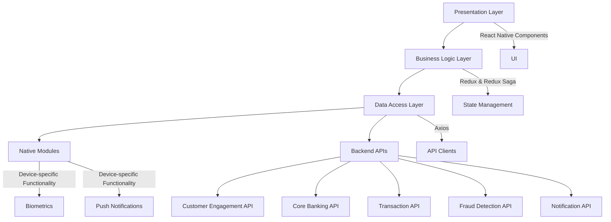

# Architecture Overview

The Mobile Banking App is built using React Native, allowing for cross-platform development for both iOS and Android devices.

## High-Level Architecture

1. **Presentation Layer**: React Native components and screens
2. **Business Logic Layer**: Redux for state management, Sagas for side effects
3. **Data Access Layer**: API clients for interacting with backend services
4. **Native Modules**: For device-specific functionality (e.g., biometrics, push notifications)

## Key Dependencies

- React Native
- Redux & Redux Saga
- React Navigation
- Axios for API calls
- Jest for testing

## API Integrations

The app integrates with several backend APIs:

- Customer Engagement API
- Core Banking API
- Transaction API
- Fraud Detection API
- Notification API

For details on each API integration, see the [API Integration](api_integration/) section.

## Security Considerations

- End-to-end encryption for all data transmission
- Biometric authentication support
- Secure storage for sensitive data using Keychain (iOS) and Keystore (Android)
- Certificate pinning for API calls

## Performance Optimization

- Lazy loading of non-critical components
- Efficient list rendering using FlatList
- Memoization of expensive computations
- Optimized images and assets
